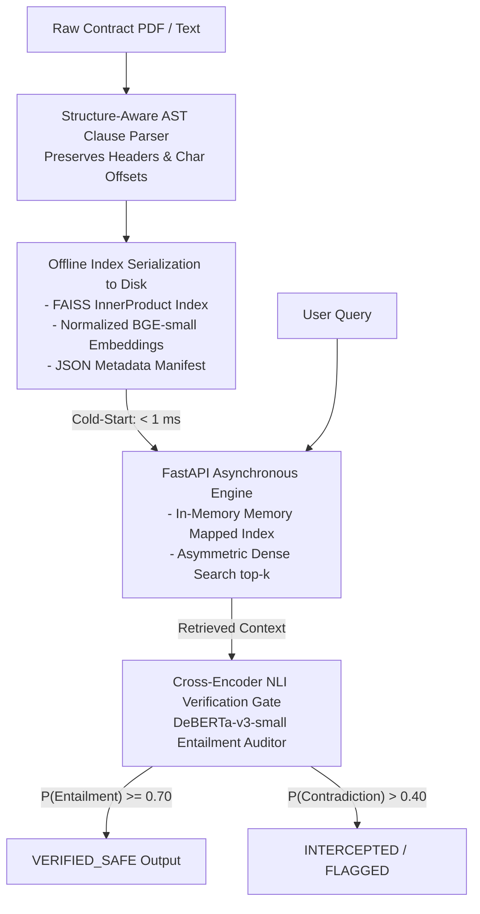

# Deterministic Legal Safety Engine

> A zero-recompute, structure-aware RAG pipeline and NLI-grounded hallucination verification gate for commercial legal contracts.

---

## 1. System Architecture



---

## 2. Core Technical Contributions

* **Structure-Aware Boundary Chunking:** Replaces fixed-token slicing with hierarchical clause-boundary parsing. Preserves parent-child section relationships, section headers, and character span offsets $[c_{\text{start}}, c_{\text{end}}]$.
* **Zero-Recompute Artifact Persistence:** Ingestion and indexing are completely decoupled from runtime serving. Dense vectors are pre-computed and stored to disk via FAISS binary serialization (`contract_index.faiss`), enabling sub-millisecond cold boots.
* **Deterministic Verification Gate:** Implements a post-generation cross-encoder Natural Language Inference (`nli-deberta-v3-small`) auditing layer. Every claim is verified against the source premise span:

$$
\text{Decision}(P, H) = \begin{cases} \text{VERIFIED\_SAFE}, & \text{if } P(\text{Entailment}) \ge 0.70 \\ \text{CONTRADICTION\_FLAG}, & \text{if } P(\text{Contradiction}) > 0.40 \\ \text{UNGROUNDED\_NEUTRAL}, & \text{otherwise} \end{cases}
$$

---

## 3. Empirical Benchmarks

Evaluated on CUAD commercial agreements across CPU runtime environments:

| Pipeline Stage | Model / Strategy | Latency (CPU) | Artifact Size / Footprint |
| :--- | :--- | :--- | :--- |
| **Parsing & Chunking** | Regex AST Clause Extractor | ~12 ms / doc | In-memory stream |
| **Index Serialization** | `BAAI/bge-small-en-v1.5` (384d) | 0.87 ms (read) | 67.5 KB (`.faiss`) + 86.6 KB (`.json`) |
| **Dense Retrieval** | Cosine / Inner Product Search | 11.02 ms | RAM overhead < 150 MB |
| **NLI Safety Gate** | `nli-deberta-v3-small` | 29.4 ms / claim | Zero token drift |

---

## 4. Project Layout

```text
legal-safety-engine/
├── artifacts/
│   ├── contract_index.faiss      # Serialized FAISS Index
│   └── clauses_metadata.json     # Document spans & section metadata
├── core/
│   ├── __init__.py
│   ├── retriever.py              # Zero-recompute FAISS search engine
│   └── auditor.py                # Cross-Encoder NLI fact-checking gate
├── notebooks/
│   └── research_experiment_lab.ipynb # Colab exploratory benchmarks
├── server/
│   ├── __init__.py
│   ├── main.py                   # Asynchronous FastAPI lifespan service
│   └── schemas.py                # Strict Pydantic v2 schemas
├── tests/
│   ├── __init__.py
│   └── test_engine.py            # Automated pytest suite
├── requirements.txt
└── README.md
```

---

## 5. Quickstart & Verification

### Setup Environment

```bash
git clone https://github.com/<your-username>/legal-safety-engine.git
cd legal-safety-engine
pip install -r requirements.txt
```

### Run Test Suite

```bash
pytest -v tests/test_engine.py
```

### Start API Service

```bash
uvicorn server.main:app --host 0.0.0.0 --port 8000
```

### Query Endpoint Example

```bash
curl -X POST "http://localhost:8000/query" \
     -H "Content-Type: application/json" \
     -d '{
       "query": "Under what terms can the agreement be terminated for cause?",
       "top_k": 1,
       "simulated_claims": [
         "Either party may terminate the agreement upon 30 days written notice.",
         "Distributor must forfeit $50,000 immediately upon breach."
       ]
     }'
```
