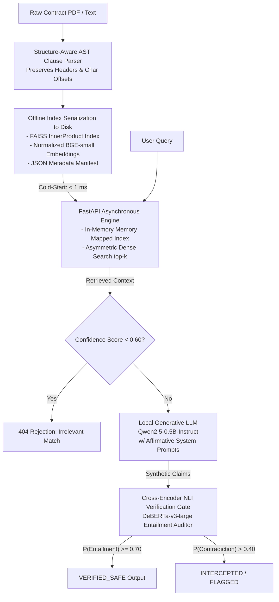

# Deterministic Legal Safety Engine

> A zero-recompute, structure-aware RAG pipeline and NLI-grounded hallucination verification gate for commercial legal contracts.

---

## 1. System Architecture



---

## 2. Core Technical Contributions

* **Offline Ingestion & Chunking (`core/parser.py`):** Accepts raw PDFs or TXT documents. Replaces fixed-token slicing with hierarchical clause-boundary parsing. Preserves parent-child section relationships and character offsets. Dynamically reconstructs the FAISS index on the fly.
* **Local Generative Synthesis (`core/generator.py`):** Completely independent from paid APIs. Uses `Qwen2.5-0.5B-Instruct` (~490M params) running entirely on local CPU. Strict system prompts force the LLM to answer affirmatively to prevent NLI false-positives on negation.
* **Deterministic Verification Gate (`core/auditor.py`):** Implements a post-generation cross-encoder Natural Language Inference (`nli-deberta-v3-large`) auditing layer. Features an explicit guardrail bypass mechanism for out-of-scope LLM responses. Every generated claim is verified against the source premise span:

$$
\text{Decision}(P, H) = \begin{cases} \text{VERIFIED SAFE}, & \text{if } P(\text{Entailment}) \ge 0.70 \text{ or Exact Substring} \\\\ \text{CONTRADICTION FLAG}, & \text{if } P(\text{Contradiction}) > 0.40 \\\\ \text{UNGROUNDED NEUTRAL}, & \text{otherwise} \end{cases}
$$

---

## 3. Empirical Benchmarks

Evaluated on CUAD commercial agreements across CPU runtime environments:

| Pipeline Stage | Model / Strategy | Footprint / Latency |
| :--- | :--- | :--- |
| **Index Serialization** | `BAAI/bge-small-en-v1.5` (384d) | 67.5 KB (`.faiss`) + 86.6 KB (`.json`) |
| **Dense Retrieval** | Cosine / Inner Product Search | < 15 ms |
| **Local Synthesis** | `Qwen2.5-0.5B-Instruct` | ~1 GB RAM footprint |
| **NLI Safety Gate** | `nli-deberta-v3-large` | ~1.5 GB RAM footprint |

---

## 4. Project Layout

```text
legal-safety-engine/
├── artifacts/
│   ├── contract_index.faiss      # Serialized FAISS Index
│   └── clauses_metadata.json     # Document spans & section metadata
├── core/
│   ├── parser.py                 # PDF/TXT Ingestion & AST Extraction
│   ├── retriever.py              # Zero-recompute FAISS search engine
│   ├── generator.py              # Qwen2.5 Local CPU Inference
│   └── auditor.py                # DeBERTa-v3-large Fact-Checking Gate
├── server/
│   ├── static/
│   │   └── index.html            # Zero-dependency Tailwind Glassmorphism UI
│   ├── main.py                   # Asynchronous FastAPI service & Rejection Gate
│   └── schemas.py                # Strict Pydantic v2 schemas
├── tests/
│   └── test_engine.py            # Automated pytest suite
└── README.md
```

---

## 5. Quickstart & Verification

### Setup Environment

```bash
git clone https://github.com/yellowgram1543/legal-safety-engine.git
cd legal-safety-engine
pip install -r requirements.txt
pip install pypdf python-multipart
```

### Start API Service & UI Dashboard

```bash
uvicorn server.main:app --host 0.0.0.0 --port 8000
```

1. Open your browser to `http://localhost:8000`.
2. Click **Upload Contract** in the top right to ingest a PDF or TXT.
3. Type a query into the search bar and hit **Audit** to watch the local LLM generate claims and the NLI model fact-check them in real-time.

### Run Automated Test Suite

```bash
pytest -v tests/test_engine.py
```
